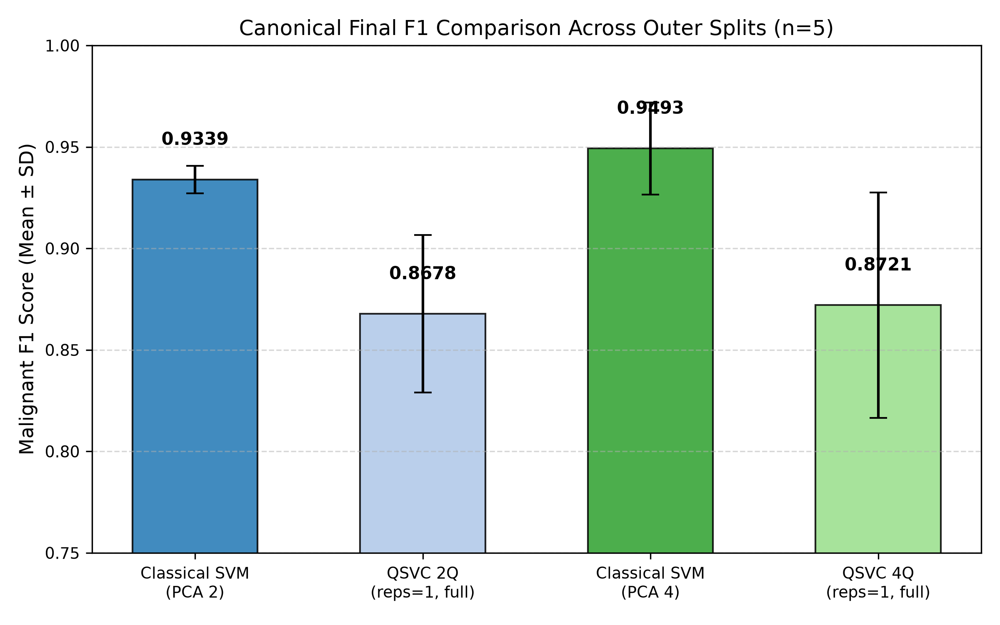
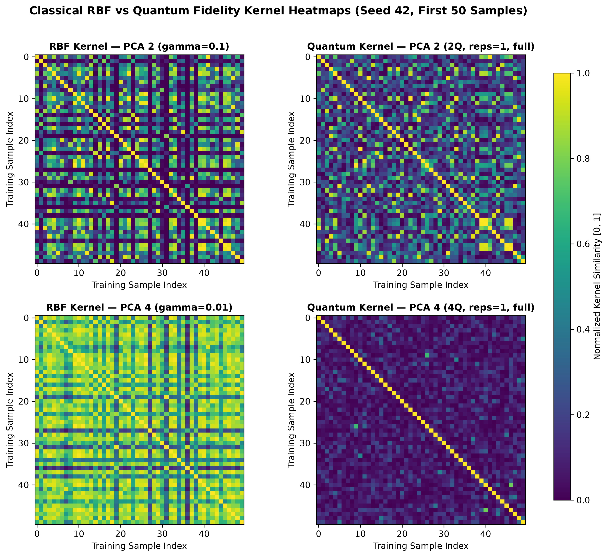

# Classical SVM vs Quantum Kernel SVM for Breast Cancer Classification

[](https://www.python.org/downloads/)
[](LICENSE)
[](results/final/repository_validation.json)
[](tests/)

A controlled, leakage-free empirical benchmark evaluating whether Quantum Support Vector Classifiers (QSVC with parameterized ZZ feature maps) provide an advantage over tuned Classical Support Vector Machines (Linear and RBF kernels) on the Wisconsin Diagnostic Breast Cancer dataset.

---

## Overview

Support Vector Classifiers mapped into quantum Hilbert spaces via non-linear feature maps have been hypothesized to offer potential advantages in expressive capacity or sample efficiency. This research study conducts a rigorous, multi-seed controlled benchmark of classical vs quantum kernel machines using nested cross-validation, fold-specific preprocessing, and exact statevector simulation.

---

## Research Question

> **Does a Quantum Support Vector Classifier utilizing parameterized ZZ feature maps achieve superior classification accuracy, malignant F1 score, or small-sample efficiency compared to tuned classical Linear and RBF SVM baselines on real-world medical diagnostic data?**

---

## Main Findings

* **No Quantum Advantage Observed:** Classical SVM baselines consistently outperformed QSVC across all evaluated dimensions, metrics, and outer splits.
* **Predictive Performance:**
  * **PCA 2:** Classical F1 $\approx 0.934$ vs QSVC F1 $\approx 0.868$ (Paired Difference: $+0.0662$).
  * **PCA 4:** Classical F1 $\approx 0.949$ (Linear: $0.9565$) vs QSVC F1 $\approx 0.872$ (Paired Difference: $+0.0772$).
  * Classical models achieved higher scores on all 5 observed outer splits (5/5 wins).
* **Depth Sensitivity:** QSVC is acutely sensitive to circuit depth. Shallow feature maps (`reps=1, full`) substantially outperform deeper configurations (`reps=2, 3`), where performance collapses due to state orthogonality and kernel concentration.
* **No Small-Data Advantage:** At $N=50$ training samples, Classical Linear SVM retained high diagnostic accuracy (F1 $\approx 0.915$), whereas QSVC suffered severe performance degradation (F1 $\approx 0.740$ for 2Q; F1 $\approx 0.499$ for 4Q).
* **Geometric Novelty vs Utility:** Centered Kernel Alignment (CKA) confirmed that 4-qubit quantum kernel geometry departed substantially from classical RBF geometry (CKA $\approx 0.338$). However, this geometric transformation did not translate to superior classification boundaries.
* **Computational Cost:** Exact statevector quantum simulation was $\sim 45\times$ (2Q) to $\sim 80\times$ (4Q) slower than classical LibSVM optimization on CPU.

---

## Canonical Visualizations

### Final Outer-Test Malignant F1 Score Comparison


### Sample-Size Scaling Dynamics ($N \in [50, 100, 200, 300, 455]$)


### Classical RBF vs Quantum Kernel Gram Geometry & CKA


---

## Canonical Final Results

Mean $\pm$ Sample Standard Deviation across 5 frozen outer splits (`SEEDS = [42, 123, 456, 789, 2026]`):

| Model | PCA Dims | Qubits | Kernel / Feature Map | Accuracy | Precision | Recall | Malignant F1 | ROC-AUC | Total Runtime (s) |
| :--- | :---: | :---: | :--- | :---: | :---: | :---: | :---: | :---: | :---: |
| **Classical SVM (Comparator)** | **2** | **0** | **Linear / RBF (Inner Selected)** | **0.9509 ± 0.0048** | **0.9257 ± 0.0162** | **0.9429 ± 0.0213** | **0.9339 ± 0.0068** | **0.9866 ± 0.0074** | **0.0060 ± 0.0016** |
| Tuned Linear SVM | 2 | 0 | Linear ($C \in \{0.1, 1.0\}$) | 0.9509 ± 0.0078 | 0.9266 ± 0.0318 | 0.9429 ± 0.0213 | 0.9341 ± 0.0093 | 0.9894 ± 0.0030 | 0.0048 ± 0.0007 |
| Tuned RBF SVM | 2 | 0 | RBF ($C \in \{10, 100\}, \gamma$) | 0.9456 ± 0.0096 | 0.9245 ± 0.0182 | 0.9286 ± 0.0238 | 0.9263 ± 0.0133 | 0.9810 ± 0.0119 | 0.0072 ± 0.0024 |
| **Tuned QSVC (Canonical)** | **2** | **2** | **ZZ Map (reps=1, full, $C$)** | **0.9070 ± 0.0237** | **0.9064 ± 0.0457** | **0.8381 ± 0.0832** | **0.8678 ± 0.0388** | **0.9644 ± 0.0244** | **0.2257 ± 0.0232** |
| **Classical SVM (Comparator)** | **4** | **0** | **Linear / RBF (Inner Selected)** | **0.9632 ± 0.0157** | **0.9547 ± 0.0235** | **0.9476 ± 0.0261** | **0.9493 ± 0.0227** | **0.9941 ± 0.0039** | **0.0075 ± 0.0040** |
| Tuned Linear SVM | 4 | 0 | Linear ($C \in \{0.01, 0.1, 1.0, 100\}$) | 0.9684 ± 0.0100 | 0.9671 ± 0.0255 | 0.9476 ± 0.0391 | 0.9565 ± 0.0143 | 0.9952 ± 0.0029 | 0.0083 ± 0.0061 |
| Tuned RBF SVM | 4 | 0 | RBF ($C \in \{10, 100\}, \gamma$) | 0.9561 ± 0.0139 | 0.9434 ± 0.0244 | 0.9381 ± 0.0398 | 0.9401 ± 0.0198 | 0.9935 ± 0.0045 | 0.0071 ± 0.0019 |
| **Tuned QSVC (Canonical)** | **4** | **4** | **ZZ Map (reps=1, full, $C=1.0$)** | **0.9053 ± 0.0423** | **0.8748 ± 0.0767** | **0.8762 ± 0.0832** | **0.8721 ± 0.0556** | **0.9581 ± 0.0227** | **0.6599 ± 0.0863** |

*Note: Malignant label 0 is positive for precision, recall, F1, and ROC-AUC. Classical comparator selected via 5-fold inner CV per seed.*

---

## Statistical Analysis

* **Wilcoxon Signed-Rank Test:** Two-sided exact test evaluated across matching outer splits.
  * Classical PCA2 vs QSVC PCA2: Mean Paired Difference $= +0.0662$, 5/5 wins, exact $p = 0.0625$, Holm-adjusted $p = 0.1875$, Bootstrap 95% CI $[0.0388, 0.0977]$.
  * Classical PCA4 vs QSVC PCA4: Mean Paired Difference $= +0.0772$, 5/5 wins, exact $p = 0.0625$, Holm-adjusted $p = 0.1875$, Bootstrap 95% CI $[0.0445, 0.1092]$.
* **Methodological Power Bounding:** With $n=5$ overlapping splits, the minimum possible two-sided exact Wilcoxon p-value is bounded at $0.0625$. These results provide consistent empirical evidence on this dataset but remain exploratory rather than formal asymptotic proof.

---

## Repository Structure

```text
SVM-Vs-QSVM/
│
├── README.md                           # Repository overview and canonical findings
├── LICENSE                             # MIT License
├── requirements.txt                    # Pinned and bounded package dependencies
├── pyproject.toml                      # Project metadata and editable install definition
├── .gitignore                          # Standard git ignore rules
│
├── configs/                            # Centralized experimental configuration
│   ├── base.yaml                       # Core dataset, seed, and grid parameters
│   ├── phase9_ablation.yaml            # Feature-map ablation parameter space
│   ├── phase10_scaling.yaml            # Sample-size scaling parameters
│   └── phase11_tuning.yaml             # Nested cross-validation configuration
│
├── notebooks/
│   └── svm_vs_qsvm_setup.ipynb         # Full exploratory research narrative & executed record
│
├── src/
│   └── svm_vs_qsvm/                    # Reusable modular research package
│       ├── __init__.py                 # Package version and export definitions
│       ├── data.py                     # Dataset loading and stratified partitioning
│       ├── preprocessing.py            # Leakage-safe scaling and PCA transforms
│       ├── classical.py                # Classical SVM constructors & candidate selection
│       ├── quantum.py                  # ZZ feature maps and exact statevector routines
│       ├── kernels.py                  # Gram evaluation, diagnostics, alignment, CKA
│       ├── metrics.py                  # Malignant-oriented diagnostic metric functions
│       ├── statistics.py               # Wilcoxon, Holm adjustment, bootstrap CIs
│       ├── plotting.py                 # Figure generation routines
│       └── utils.py                    # Constants, model naming, config loaders
│
├── scripts/                            # Executable reproduction and validation CLIs
│   ├── run_baselines.py                # Run classical SVM baselines
│   ├── run_ablation.py                 # Run quantum feature-map ablation
│   ├── run_scaling.py                  # Run sample-size scaling benchmark
│   ├── run_tuning.py                   # Run nested CV hyperparameter search
│   ├── build_final_report.py           # Synthesize canonical tables and figures
│   ├── validate_project.py             # One-command full repository validation
│   └── reproduce_final.py              # Lightweight fast modern reproduction script
│
├── tests/                              # Automated test suite (23 passing tests)
│   ├── conftest.py                     # Root test path configuration
│   ├── test_preprocessing.py           # Preprocessing leakage isolation tests
│   ├── test_quantum_kernel.py          # Gram matrix symmetry, PSD, and CKA properties
│   ├── test_regression.py              # Numerical regression test on seed 42
│   ├── test_phase11.py                 # Frozen Phase 11 statistical and scoring tests
│   └── test_phase12.py                 # Frozen Phase 12 final synthesis tests
│
├── results/                            # Persisted research artifacts
│   ├── final/                          # Canonical final figures, tables, and report
│   └── ...                             # Historical raw CSV files from Phases 1–11
│
└── docs/                               # Detailed methodology and reproduction documentation
    ├── methodology.md                  # Mathematical and experimental design details
    ├── reproducibility.md              # Reproduction guide, runtimes, and seeds
    └── results_summary.md              # Concise executive summary of results
```

---

## Installation

```bash
# Clone the repository
git clone https://github.com/SinaQP/SVM-Vs-QSVM.git
cd SVM-Vs-QSVM

# Create virtual environment
python -m venv .venv
.\.venv\Scripts\activate  # On Linux/macOS: source .venv/bin/activate

# Install in editable mode
pip install -e .
```

---

## Quick Start & One-Command Validation

Verify the entire repository, package imports, and test suite:
```bash
python scripts/validate_project.py
```

Run the lightweight fast reproduction pipeline (outputs to `results/reproduced/`):
```bash
python scripts/reproduce_final.py
```

Run the automated test suite:
```bash
pytest -v
```

---

## Documentation

* [Research Methodology](docs/methodology.md): Detailed dataset properties, leakage protection, feature map mathematics, statevector simulation, and statistical protocols.
* [Reproducibility Guide](docs/reproducibility.md): Complete instructions for running experiment scripts, execution runtimes, and seed management.
* [Results Summary](docs/results_summary.md): Synthesis of performance tables, ablation outcomes, scaling plots, and kernel alignment.
* [Canonical Final Research Report](results/final/final_research_report.md): Full 19-section research report.

---

## Limitations

* **Dataset Scope:** Single tabular diagnostic dataset (WDBC, $N=569$). Conclusions do not generalize to image, text, or inherently quantum data.
* **Dimensionality:** Evaluated at PCA compression to 2 and 4 dimensions ($63.5\%$ and $79.4\%$ variance).
* **Qubit Scale:** Evaluated at 2 and 4 qubits. Does not benchmark classically intractable scales ($q \ge 40$).
* **Feature Map Architecture:** Standard second-order ZZ Pauli expansion. Custom or data-reuploading architectures may yield different geometries.
* **Sample Overlap:** Five overlapping 80/20 splits share patient records, bounding exact Wilcoxon resolution.
* **Simulation Mode:** Exact noise-free statevector simulation on CPU. Does not evaluate physical NISQ device noise, decoherence, or shot noise.

---

## Project Status

```text
Research implementation:         COMPLETE
Experimental study:              COMPLETE
Statistical analysis:            COMPLETE
Final synthesis:                 COMPLETE
Repository packaging:            COMPLETE
Physical QPU validation:         NOT PERFORMED
Independent dataset validation:  NOT PERFORMED
Paper manuscript:                NOT PERFORMED
```

---

## License

This project is licensed under the MIT License — see the [LICENSE](LICENSE) file for details.
