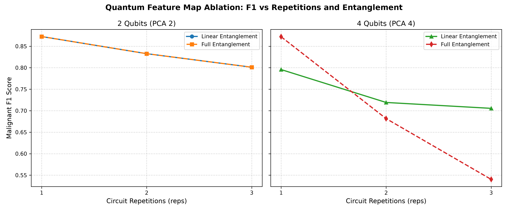
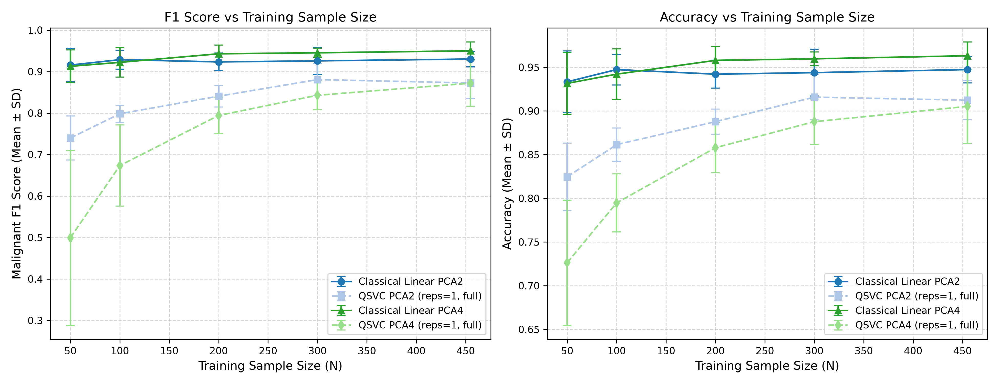
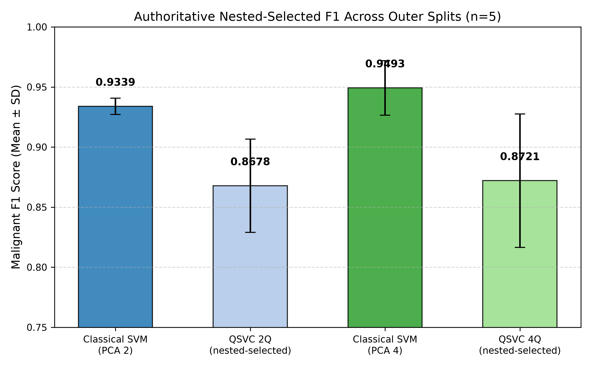
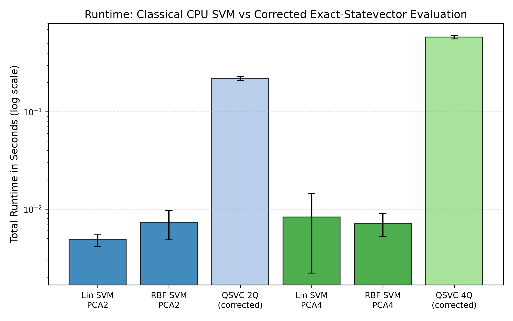

# A Controlled Empirical Comparison of Classical and Quantum Kernel SVMs for Breast Cancer Classification

**Repository:** [https://github.com/SinaQP/SVM-Vs-QSVM](https://github.com/SinaQP/SVM-Vs-QSVM)  
**Release:** `v1.0.0` (Frozen Canonical Benchmark)  
**Target Manuscript Status:** Final Quality-Reviewed Manuscript
**Primary Endpoint:** Malignant Class F1 Score (`pos_label=0`)  

---

## Abstract

Quantum kernels offer flexible similarity measures, but evidence for their practical value depends on controlled comparisons with tuned classical baselines. We compare linear and radial-basis-function support vector classifiers with fixed ZZ-feature-map quantum support vector classifiers (QSVCs) on the Wisconsin Diagnostic Breast Cancer benchmark (569 samples and 30 features), treating malignant label 0 as positive. The design uses five predefined stratified 80/20 splits, fold-local preprocessing, five-fold inner cross-validation for model hyperparameters, exact statevector fidelity kernels after principal-component reduction to two or four dimensions, feature-map ablation, and fixed-hyperparameter sample-size analysis. Mean malignant-class F1 was 0.934 for the inner-selected classical comparator versus 0.868 for QSVC in two dimensions, and 0.949 versus 0.872 in four dimensions; the classical comparator was higher on all five matched splits. The corresponding two-sided exact Wilcoxon tests gave raw $p=0.0625$ and Holm-adjusted $p=0.1875$. Because the outer splits overlap and the feature-map architecture was selected using these same splits, these statistics are descriptive rather than independent confirmation. Within the tested ZZ maps, deeper full-entanglement configurations were associated with lower F1 (0.872 at one repetition and 0.540 at three repetitions in four qubits), and no small-data QSVC advantage was observed. The four-qubit kernel had lower alignment with the classical RBF kernel than the two-qubit kernel (CKA 0.338 versus 0.573), but greater geometric divergence did not improve classification. Timings measure classical CPU statevector simulation, not quantum hardware. Under these experimental conditions, no quantum advantage was observed.

**Keywords:** Quantum machine learning, Support Vector Classifier, Quantum kernel methods, ZZ feature map, Wisconsin Diagnostic Breast Cancer, Controlled empirical benchmark.

---

## 1. Introduction

Kernel methods in machine learning operate by implicitly mapping input vectors from a classical data space into a higher-dimensional reproducing kernel Hilbert space (RKHS), where non-linear decision boundaries can be identified via linear convex optimization [cortes1995support, scholkopf2002learning]. In recent years, quantum machine learning (QML) has extended this paradigm by encoding classical data vectors into quantum states via parameterized quantum circuits [havlicek2019supervised, schuld2019quantum]. By evaluating quantum state fidelities between pairs of prepared states, a quantum processor can construct a quantum kernel Gram matrix that may be classically intractable to compute, offering a potential path toward quantum advantage in classification tasks [huang2021power, schuld2021supervised].

Despite this theoretical promise, empirical conclusions in QML are highly sensitive to experimental design, attainable problem scale, and the strength of classical comparators [bowles2024better, cerezo2022challenges, leither2026benchmarking]. Preprocessing before partitioning, evaluation on a single split, and comparison with untuned baselines can all produce misleading rankings [bowles2024better]. Circuit architecture and input scaling also determine the inductive bias of a quantum kernel [hubregtsen2021evaluation, shaydulin2022importance]. These concerns motivate comparisons that isolate preprocessing and model selection from held-out evaluation and that report simulation cost separately from predictive performance.

To address these methodological shortcomings, this study presents an end-to-end controlled empirical benchmark comparing classical SVMs (Linear and Radial Basis Function kernels) against Quantum Support Vector Classifiers (QSVC with parameterized ZZ feature maps). We examine classification performance across two- and four-dimensional representations of the WDBC dataset under a strict nested cross-validation protocol evaluated across five fixed outer random splits. We systematically investigate feature-map depth and entanglement ablation, sample-size scaling dynamics, kernel geometric alignment, and computational execution costs. 

Under the evaluated conditions, no quantum advantage was observed for the tested dataset, preprocessing pipeline, qubit scale, and ZZ feature-map family. This scoped negative result does not address other datasets, embeddings, qubit counts, noisy devices, or physical QPU execution; its value lies in the controlled evidence it provides for this commonly used low-dimensional benchmark.

### 1.1 Summary of Contributions
This work makes five contributions:
1. **Controlled model selection:** Fold-specific refitting of `StandardScaler`, PCA, quantum `MinMaxScaler`, and quantum Gram matrices during inner cross-validation, with deterministic inner-selection rules for linear, RBF, and quantum SVM hyperparameters.
2. **Paired multi-split evaluation:** Matched evaluation on five predefined seeds (`[42, 123, 456, 789, 2026]`), with exact Wilcoxon statistics, Holm correction, and explicitly exploratory split-level percentile bootstrap intervals.
3. **Feature-map and sample-size analyses:** Ablation of repetitions and entanglement topology at two and four qubits, together with fixed-hyperparameter learning curves over $N_{\text{train}} \in \{50, 100, 200, 300, 455\}$.
4. **Kernel-geometry analysis:** A $4^n$ operator-feature-space account of the fidelity kernel, with effective rank and centered kernel alignment used to relate geometry to predictive performance.
5. **Reproducible negative benchmark:** Frozen results, per-fold selection records, predictions, figures, environment metadata, and validation scripts that make the scoped absence of quantum advantage auditable.

---

## 2. Research Questions

To guide this controlled comparative investigation, we establish seven explicit research questions:

* **RQ1 (Accuracy):** Does the evaluated quantum kernel improve classification accuracy relative to tuned classical SVM baselines?
* **RQ2 (Predictive Metrics):** How do malignant-class F1 score and ROC-AUC compare between classical and quantum kernel machines?
* **RQ3 (Dimensionality Scaling):** How does QSVC behavior change when expanding from two to four PCA dimensions and corresponding qubits?
* **RQ4 (Computational Cost):** What measured CPU overhead does exact statevector kernel evaluation incur, and how should that measurement be distinguished from general scaling and QPU cost?
* **RQ5 (Quantum Kernel Geometry):** What similarity geometry, off-diagonal distribution, and spectral effective rank are induced by the quantum feature map?
* **RQ6 (Geometric Alignment):** How substantially does the quantum kernel geometry depart from the classical RBF similarity geometry as measured by Centered Kernel Alignment (CKA)?
* **RQ7 (Split Stability):** Are the observed empirical rankings stable across the five predefined, overlapping random train/test partitions?

---

## 3. Related Work

The literature contextualizing quantum kernel classifiers spans classical statistical learning theory, quantum circuit expressivity, kernel geometry, and empirical benchmarking rigor.

### 3.1 Classical Kernel Methods and Inductive Biases
Classical Support Vector Machines (SVMs) formulate pattern classification as the identification of a maximal-margin separating hyperplane in an inner-product space [cortes1995support, scholkopf2002learning]. When patterns are not linearly separable in their original representation, Mercer kernels $k(\mathbf{x}, \mathbf{x}') = \langle \phi(\mathbf{x}), \phi(\mathbf{x}') \rangle_{\mathcal{H}}$ implicitly project inputs into a reproducing kernel Hilbert space $\mathcal{H}$ without requiring explicit coordinate evaluation [cristianini2000introduction]. For tabular and continuous biological datasets, Linear and Gaussian Radial Basis Function (RBF) kernels provide well-characterized inductive biases [guyon2002gene]. Classical SVM optimization is solved via dual convex quadratic programming, where libraries such as LibSVM implement highly efficient Sequential Minimal Optimization (SMO) routines scaling between $\mathcal{O}(N^2)$ and $\mathcal{O}(N^3)$ in sample size [chang2011libsvm, pedregosa2011scikit].

### 3.2 Quantum Feature Maps and Quantum Kernel Formulations
Quantum kernel methods replace classical non-linear feature maps with quantum state preparation unitaries $U_\Phi(\mathbf{x})$ acting on an $n$-qubit reference state $|0^{\otimes n}\rangle$ [havlicek2019supervised, schuld2019quantum]. This operation maps a classical vector $\mathbf{x} \in \mathbb{R}^d$ to a quantum pure state $|\psi(\mathbf{x})\rangle$ or density operator $\rho(\mathbf{x}) = |\psi(\mathbf{x})\rangle\langle\psi(\mathbf{x})|$. The corresponding kernel is evaluated as the quantum transition fidelity:
$$K(\mathbf{x}, \mathbf{x}') = |\langle \psi(\mathbf{x}) | \psi(\mathbf{x}') \rangle|^2 = \text{Tr}\left[\rho(\mathbf{x})\rho(\mathbf{x}')\right]$$
Schuld demonstrated that supervised quantum classifiers trained with variational parameters are fundamentally linear models in quantum feature spaces, establishing formal equivalence between variational quantum classifiers (VQCs) and quantum kernel machines [schuld2021supervised]. The Second-Order Pauli-Z Expansion (`ZZFeatureMap`) proposed by Havlíček et al. [havlicek2019supervised] encodes features via single-qubit phase gates and entangles qubits using pairwise controlled-phase rotations. This architecture derives its theoretical motivation from instantaneous quantum polynomial (IQP) circuit families, for which classical sampling of the output distribution is conjectured to be intractable under standard complexity assumptions [bremner2016average, suzuki2020analysis]. However, Hubregtsen et al. [hubregtsen2021evaluation] observed that higher circuit entanglement does not correlate monotonically with improved classification accuracy, and alternative architectures such as data re-uploading [perezsalinas2020data] have been proposed to enhance expressivity.

### 3.3 Quantum Kernel Generalization, Concentration, and Untrainability
Quantum-kernel concentration is a recognized scalability concern related to, but distinct from, barren plateaus in variational optimization [mcclean2018barren, holmes2022connecting]. Thanasilp, Wang, Cerezo, and Holmes [thanasilp2024exponential] derived exponential concentration bounds under specified conditions involving embedding expressivity, entanglement, global measurements, or noise. For a fidelity kernel evaluated through a global overlap measurement, sufficiently small off-diagonal values may be indistinguishable with polynomially many shots, yielding an effectively uninformative estimated Gram matrix. These asymptotic results do not by themselves diagnose concentration in a two- or four-qubit exact-kernel experiment. Kübler, Buchholz, and Schölkopf [kubler2021inductive] analyzed the role of inductive bias and data alignment in quantum kernels, while Shaydulin and Wild [shaydulin2022importance] showed that input scaling functions as a kernel-bandwidth hyperparameter.

### 3.4 Sample Complexity and Quantum Machine Learning on Small Datasets
Generalization bounds show that some quantum models can generalize from limited training data when their effective complexity is controlled [caro2022generalization, banchi2021generalization]. Canatar et al. [canatar2023spectral] related learning behavior to kernel spectra and task-model alignment. Such bounds characterize learnability; they do not imply that a quantum kernel will be more sample-efficient than a tuned classical model on a given classical dataset. We therefore treat small-data performance as an empirical question rather than a presumed quantum advantage.

### 3.5 Quantum Machine Learning on Biomedical and Oncological Data
Biomedical QML studies span materially different tasks. Wang [wang2024novel] combined a quantum SVM with multi-objective feature selection on a breast-cancer dataset, whereas Azevedo, Silva, and Dutra [azevedo2022quantum] studied hybrid quantum transfer learning for full-image mammography. Leither, Lubinski, Kubal, and Johri [leither2026benchmarking] subsequently compared quantum and AutoML-optimized classical models across tabular, omics, and spatial oncology datasets and reported no evidence of quantum advantage. Differences in data modality, preprocessing, feature selection, comparator strength, and validation design prevent direct leaderboard-style comparison. The present study instead isolates a reproducible WDBC kernel benchmark with paired splits and explicit model-selection records.

### 3.6 Empirical Evaluation, Benchmarking Rigor, and Quantum Advantage Claims
Claims of quantum advantage require an end-to-end accounting of the learning task, data access, classical comparators, and evaluation protocol [cerezo2022challenges, preskill2018quantum]. Aaronson [aaronson2015read] emphasized input/output caveats in quantum speedup claims, while Tang [tang2019quantum] showed that a recommendation-system speedup could be dequantized under comparable data-access assumptions. Bowles, Ahmed, and Schuld [bowles2024better] evaluated 12 QML models on 160 derived binary datasets and found that experimental design and baseline choice materially affect rankings. These studies motivate identical partitions, train-only preprocessing, tuned classical models, and restrained interpretation at the small scales accessible to simulation.

---

## 4. Dataset and Problem Formulation

The empirical evaluation is conducted on the **Wisconsin Diagnostic Breast Cancer (WDBC)** dataset, originally compiled by Street, Wolberg, and Mangasarian [street1993nuclear] and distributed through scikit-learn [pedregosa2011scikit]. 

* **Sample Size:** $N = 569$ patient observations.
* **Feature Space:** 30 continuous real-valued features computed from digitized images of fine needle aspirates (FNA) of breast masses, describing characteristics of cell nuclei (e.g., radius, texture, perimeter, area, smoothness, compactness, concavity, concave points, symmetry, and fractal dimension across mean, standard error, and "worst" measurements).
* **Target Classes:** Binary classification:
  * **Malignant:** 212 samples (37.26%).
  * **Benign:** 357 samples (62.74%).
* **Positive Class Designation:** **Malignant (Class 0)** is treated as the predefined positive class (`pos_label=0`) across all precision, recall, F1, and ROC-AUC evaluations. Decision scores are oriented consistently to that label.
* **Methodological Scope Disclaimer:** This investigation is strictly designed as a methodological machine-learning benchmark evaluating kernel representations. It does **not** constitute a clinical validation study, and the resulting models are not intended for medical diagnostic decision-making.

---

## 5. Experimental Protocol and Leakage Prevention

The experimental architecture uses five predefined outer splits with nested inner cross-validation: `SEEDS = [42, 123, 456, 789, 2026]` [bowles2024better].

```text
                                 [ Raw Dataset: N=569 ]
                                           │
                       Stratified Outer Split (80% / 20%)
                                           │
         ┌─────────────────────────────────┴─────────────────────────────────┐
         ▼                                                                   ▼
[ Outer Train: N=455 ]                                              [ Outer Test: N=114 ]
         │                                                            (STRICTLY QUARANTINED)
         ├──────────────────────────────────────────┐                                │
         ▼                                          ▼                                │
[ Preprocessing Fit ]                      [ Inner 5-Fold CV ]                       │
• StandardScaler.fit()                    • Inner fold train (N=364)                 │
• PCA.fit() (2 or 4 dims)                 • Inner fold val (N=91)                    │
• Quantum MinMaxScaler.fit([0, π])        • Refit preprocessors in fold              │
         │                                • Hyperparameter tuning:                   │
         │                                  C ∈ {0.01..100}, γ candidates            │
         │                                • Select best inner Malignant F1           │
         │                                          │                                │
         ├──────────────────────────────────────────┘                                │
         ▼                                                                           │
[ Refit Selected Model on Full Outer Train (N=455) ]                                 │
         │                                                                           │
         ▼                                                                           │
[ Out-of-Sample Transform & Evaluation ] ───────────────────────────────────────────►┘
• Preprocessing applied via .transform()
• Outer Test evaluated only after within-phase fitting and selection
```

### 5.1 Partitioning Protocol
1. **Outer Split:** An 80/20 stratified partition divides the 569 samples into 455 training observations and 114 test observations. Outer test partitions remain completely quarantined during all preprocessing fitting and hyperparameter selection.
2. **Inner Cross-Validation:** Within each outer training set ($N=455$), a 5-fold stratified cross-validation is performed (364 training, 91 validation per fold).
3. **Leakage Protection:** `StandardScaler`, `PCA`, and quantum `MinMaxScaler` are fitted exclusively on the training split of the respective partition [pedregosa2011scikit]. They are applied to validation and test partitions strictly via `transform()`. In the inner tuning phase, transformers and quantum Gram matrices are independently recomputed inside each fold.

The same five outer partitions were reused across the exploratory feature-map ablation, sample-size analysis, and final tuned comparison. Thus, train/test separation was preserved within each evaluation, but the final comparison is not an independent confirmation of the architecture choice. This reuse is treated as a limitation rather than described as a fully nested selection of the feature map.

### 5.2 Dimensionality Reduction
Due to qubit scalability constraints in current quantum simulators and NISQ devices [preskill2018quantum], the 30 standardized features are compressed using Principal Component Analysis (PCA):
* **PCA 2:** 2 principal components capturing $63.5\% \pm 0.6\%$ of cumulative feature variance.
* **PCA 4:** 4 principal components capturing $79.4\% \pm 0.4\%$ of cumulative feature variance.

---

## 6. Classical Support Vector Machine Baselines

Classical benchmarks utilize the standard LibSVM implementation via scikit-learn [pedregosa2011scikit, chang2011libsvm]:

1. **Linear SVM (`SVC(kernel='linear')`):** Linear decision hyperplane optimized over regularization parameter $C \in \{0.01, 0.1, 1.0, 10.0, 100.0\}$ [cortes1995support].
2. **Radial Basis Function (RBF) SVM (`SVC(kernel='rbf')`):** Non-linear Gaussian kernel $K(\mathbf{x}, \mathbf{x}') = \exp(-\gamma \|\mathbf{x} - \mathbf{x}'\|^2)$ optimized over $C \in \{0.01, 0.1, 1.0, 10.0, 100.0\}$ and $\gamma \in \{\text{'scale'}, \text{'auto'}, 0.01, 0.1, 1.0\}$ [scholkopf2002learning, guyon2002gene].
3. **Inner-Selected Classical Comparator:** To prevent selective reporting bias, the classical model family (Linear vs. RBF) and hyperparameter configuration achieving the highest mean inner-CV malignant F1 score is designated as the canonical classical comparator for that outer split [bowles2024better]. Ties are resolved deterministically by favoring smaller $C$, followed by Linear over RBF.

Accuracy is reported for overall classification. Precision, recall, and F1 use malignant label 0 as the positive class. ROC-AUC is computed from decision scores negated so that larger scores indicate malignancy. Means and sample standard deviations summarize the five outer splits; only malignant-class F1 belongs to the predefined inferential family.

---

## 7. Quantum Kernel Support Vector Classifier (QSVC)

### 7.1 Quantum Feature Map Formulation
The quantum classifier maps classical feature vectors $\mathbf{x} \in [0, \pi]^n$ into an $n$-qubit quantum state space using the Second-Order Pauli-Z Expansion (`zz_feature_map`) implemented in Qiskit [qiskit2023, suzuki2020analysis]:
$$\mathcal{U}_{\Phi}(\mathbf{x}) = \prod_{d=1}^{\text{reps}} \left( \prod_{i < j} U_{\Phi_{i,j}}(\mathbf{x}) \prod_{k=1}^n U_{\Phi_k}(\mathbf{x}) H^{\otimes n} \right)$$
where $H^{\otimes n}$ denotes a layer of Hadamard gates initializing an equal superposition, $U_{\Phi_k}(\mathbf{x}) = \exp(-i \Phi_k(\mathbf{x}) Z_k / 2)$ encodes individual features via single-qubit phase rotations with $\Phi_k(\mathbf{x}) = 2 x_k$, and $U_{\Phi_{i,j}}(\mathbf{x}) = \exp(-i \Phi_{i,j}(\mathbf{x}) Z_i Z_j / 2)$ encodes pairwise non-linear interactions via two-qubit controlled-phase gates with:
$$\Phi_{i,j}(\mathbf{x}) = 2(\pi - x_i)(\pi - x_j)$$
As demonstrated by Shaydulin and Wild [shaydulin2022importance], mapping input components to $[0, \pi]$ sets an effective bandwidth scale for the statevector encoding.

### 7.2 Fidelity Kernel and Operator Feature Space
The similarity between two classical samples $\mathbf{x}_i$ and $\mathbf{x}_j$ is defined by the quantum state transition fidelity [havlicek2019supervised, schuld2019quantum]:
$$K(\mathbf{x}_i, \mathbf{x}_j) = |\langle \psi(\mathbf{x}_i) | \psi(\mathbf{x}_j) \rangle|^2 = \text{Tr}\left[ \rho(\mathbf{x}_i) \rho(\mathbf{x}_j) \right]$$
where $\rho(\mathbf{x}) = |\psi(\mathbf{x})\rangle\langle\psi(\mathbf{x})|$ is the pure state density operator.

*Operator Feature Space Formulation:* As demonstrated by Schuld [schuld2021supervised], although the underlying quantum statevectors $|\psi(\mathbf{x})\rangle$ reside in an $n$-qubit complex Hilbert state space $\mathcal{H} = \mathbb{C}^{2^n}$ of dimension $2^n$, the fidelity kernel mathematically evaluates the Hilbert-Schmidt inner product of density operators in the linear operator space $\mathcal{B}(\mathcal{H}) \cong \mathcal{H} \otimes \mathcal{H}^*$. The linear dimension of this operator feature space scales as:
$$\dim \mathcal{B}(\mathcal{H}) = (2^n)^2 = 4^n$$
(or $4^n - 1$ for the subspace of traceless Hermitian operators). Consequently, the maximum algebraic rank of the fidelity Gram matrix is $\min(N, 4^n)$—scaling up to $16$ for $n=2$ qubits ($4^2 = 16$) and up to $256$ for $n=4$ qubits ($4^4 = 256$)—rather than being bounded by the statevector dimension $2^n$.

### 7.3 Statevector Simulation Engine
To evaluate the ideal, noise-free kernel defined by the selected circuits, kernel matrices are computed by exact statevector linear algebra on classical CPUs:
$$\mathbf{K} = |\mathbf{\Psi} \mathbf{\Psi}^\dagger|^2$$
where $\mathbf{\Psi} \in \mathbb{C}^{N \times 2^n}$ represents the matrix of statevectors. Gram matrix diagonals are explicitly enforced to $K_{i,i} = 1.0$, and numerical symmetry and positive semi-definiteness ($eigvals \ge -10^{-10}$) are verified. 

*Simulation vs Hardware Distinction:* Exact statevector simulation evaluates mathematical inner products directly without shot noise, gate infidelities, or decoherence [peters2021machine]. It provides an ideal representation of the feature-map geometry but does **not** represent physical quantum processor (QPU) execution latencies.

### 7.4 Canonical QSVC Configuration
Based on controlled architectural ablation (Section 8), the canonical QSVC configuration is frozen at:
* **Two-Qubit (2Q):** PCA components $= 2$, qubits $= 2$, $\text{reps}=1$, $\text{entanglement}=\text{'full'}$.
* **Four-Qubit (4Q):** PCA components $= 4$, qubits $= 4$, $\text{reps}=1$, $\text{entanglement}=\text{'full'}$.
* Regularization parameter $C \in \{0.01, 0.1, 1.0, 10.0, 100.0\}$ is tuned via inner cross-validation.

The `reps=1`, full-entanglement architecture was chosen from the Phase 9 outer-split ablation. Only $C$ was subsequently selected within the inner folds. Because the architecture choice used the same five outer partitions later summarized in the canonical comparison, the final results remain descriptive and potentially optimistic for that selected quantum configuration.

---

## 8. Quantum Feature-Map Ablation Study

To understand the sensitivity of quantum kernel representations to circuit depth and entanglement topology, we conducted an exhaustive 60-run ablation experiment across circuit repetitions ($\text{reps} \in \{1, 2, 3\}$), entanglement topologies ($\text{'linear'}$ vs. $\text{'full'}$), and qubit dimensions ($q \in \{2, 4\}$) across all five outer splits [hubregtsen2021evaluation].



*Figure 1. Outer-test malignant-class F1 across repetitions and entanglement settings. The figure shows associations within the evaluated grid; it does not identify a causal effect of circuit depth.*

### Key Empirical Findings:
1. **Two-Qubit Regimes:** In 2Q, linear and full entanglement are algebraically identical because only a single qubit pair $(0,1)$ exists. As circuit depth increases, outer-test malignant F1 degrades monotonically:
   * $\text{reps}=1$: $\text{F1} = 0.8726 \pm 0.0376$, Effective Rank $= 7.35 \pm 0.21$
   * $\text{reps}=2$: $\text{F1} = 0.8327 \pm 0.0283$, Effective Rank $= 6.33 \pm 0.50$
   * $\text{reps}=3$: $\text{F1} = 0.8012 \pm 0.0352$, Effective Rank $= 5.90 \pm 0.40$
2. **Four-Qubit Regimes:** In 4Q, circuit depth exhibits an acute interaction with entanglement:
   * $\text{reps}=1, \text{Linear}$: $\text{F1} = 0.7957 \pm 0.0688$, Effective Rank $= 70.29 \pm 4.94$
   * **$\text{reps}=1, \text{Full}$ (Canonical):** $\text{F1} = \mathbf{0.8721 \pm 0.0556}$, Effective Rank $= \mathbf{96.49 \pm 5.41}$
   * $\text{reps}=2, \text{Linear}$: $\text{F1} = 0.7192 \pm 0.0859$, Effective Rank $= 95.80 \pm 5.39$
   * $\text{reps}=2, \text{Full}$ (Historical Baseline): $\text{F1} = 0.6816 \pm 0.0590$, Effective Rank $= 123.66 \pm 2.65$
   * $\text{reps}=3, \text{Linear}$: $\text{F1} = 0.7055 \pm 0.0493$, Effective Rank $= 93.63 \pm 4.01$
   * $\text{reps}=3, \text{Full}$: $\text{F1} = 0.5403 \pm 0.0523$, Effective Rank $= 137.43 \pm 2.83$

### Conservative Methodological Interpretation:
Within the tested 4Q full-entanglement configurations, greater repetition count was associated with lower F1 and broader effective-rank diagnostics. The design does not isolate depth from all other representation effects, and two qubit counts cannot establish an asymptotic concentration law. We therefore describe the pattern as concentration-like rather than as proof that depth caused a model collapse [thanasilp2024exponential, holmes2022connecting]. Full tabulated ablation results are documented in [Table 2](tables/table2_feature_map_ablation.md).

---

## 9. Sample-Size Scaling Dynamics

To test whether the evaluated QSVC showed an empirical advantage in small-sample regimes, we compared models across nested training subsets $N_{\text{train}} \in \{50, 100, 200, 300, 455\}$ with preprocessing refit on each subset and evaluation on fixed outer test sets ($N_{\text{test}}=114$). This learning-curve analysis held hyperparameters fixed at $C=1$ for all models, used `gamma='scale'` for RBF SVM, and used `reps=1`, full entanglement for QSVC; it is distinct from the nested hyperparameter-tuned canonical comparison.



### Key Observations:
* **Absence of Small-Data Quantum Advantage:** At $N_{\text{train}} = 50$, classical models retained strong benchmark performance:
  * Classical Linear SVM (PCA 2): $\text{F1} = 0.9157 \pm 0.0402$, $\text{Accuracy} = 0.9333 \pm 0.0354$
  * Classical Linear SVM (PCA 4): $\text{F1} = 0.9128 \pm 0.0395$, $\text{Accuracy} = 0.9316 \pm 0.0353$
  * QSVC (2Q): $\text{F1} = 0.7398 \pm 0.0531$ (performance deficit: $-0.1759$)
  * QSVC (4Q): $\text{F1} = 0.4994 \pm 0.2110$ (performance deficit: $-0.4134$, with recall collapsing to $0.4095$)
* **Sample Efficiency Convergence:** As training size expanded from $N=50$ to $N=455$, QSVC performance steadily improved (2Q: $0.740 \to 0.873$; 4Q: $0.499 \to 0.872$). However, classical SVMs maintained a substantial lead at every evaluated sample size. Complete scaling metrics are provided in [Table 3](tables/table3_sample_size_scaling.md).

---

## 10. Canonical Predictive Results

Final canonical performance metrics across the five frozen outer test splits are summarized in Table 1 and visualized in Figure 3.



*Figure 3. Mean outer-test malignant F1 with sample-standard-deviation error bars for the inner-selected classical comparator and canonical QSVC. The classical comparator had higher F1 on all five matched splits in both representations.*

### Table 1: Canonical Outer-Test Performance Summary ($n=5$ Splits)

| Model Architecture | Representation | Qubits | Test Accuracy (Mean ± SD) | Test Precision (Mean ± SD) | Test Recall (Mean ± SD) | Malignant F1 (Mean ± SD) | Test ROC-AUC (Mean ± SD) |
| :--- | :---: | :---: | :---: | :---: | :---: | :---: | :---: |
| **Classical Comparator** | **PCA 2** | **0** | **0.9509 ± 0.0048** | **0.9257 ± 0.0172** | **0.9429 ± 0.0213** | **0.9339 ± 0.0068** | **0.9866 ± 0.0074** |
| Tuned Linear SVM | PCA 2 | 0 | 0.9509 ± 0.0078 | 0.9266 ± 0.0318 | 0.9429 ± 0.0213 | 0.9341 ± 0.0093 | 0.9894 ± 0.0030 |
| Tuned RBF SVM | PCA 2 | 0 | 0.9456 ± 0.0096 | 0.9245 ± 0.0182 | 0.9286 ± 0.0238 | 0.9263 ± 0.0133 | 0.9810 ± 0.0119 |
| **Canonical QSVC** | **PCA 2** | **2** | **0.9070 ± 0.0237** | **0.9064 ± 0.0457** | **0.8381 ± 0.0832** | **0.8678 ± 0.0388** | **0.9644 ± 0.0244** |
| **Classical Comparator** | **PCA 4** | **0** | **0.9632 ± 0.0157** | **0.9570 ± 0.0184** | **0.9429 ± 0.0464** | **0.9493 ± 0.0227** | **0.9941 ± 0.0039** |
| Tuned Linear SVM | PCA 4 | 0 | 0.9684 ± 0.0100 | 0.9671 ± 0.0255 | 0.9476 ± 0.0391 | 0.9565 ± 0.0143 | 0.9952 ± 0.0029 |
| Tuned RBF SVM | PCA 4 | 0 | 0.9561 ± 0.0139 | 0.9434 ± 0.0244 | 0.9381 ± 0.0398 | 0.9401 ± 0.0198 | 0.9935 ± 0.0045 |
| **Canonical QSVC** | **PCA 4** | **4** | **0.9053 ± 0.0423** | **0.8748 ± 0.0767** | **0.8762 ± 0.0832** | **0.8721 ± 0.0556** | **0.9581 ± 0.0227** |

*Note: Source values from `results/final/final_model_comparison.csv`. For detailed per-seed breakdowns, see [Table 1](tables/table1_model_performance.md).*

### Performance Synthesis:
1. **Primary Endpoint (Malignant F1):** In the 2-dimensional representation, the Classical Comparator achieved a Malignant F1 of $0.9339 \pm 0.0068$, outperforming QSVC 2Q ($0.8678 \pm 0.0388$). In the 4-dimensional representation, the Classical Comparator achieved an F1 of $0.9493 \pm 0.0227$ (with Linear SVM reaching $0.9565 \pm 0.0143$), while QSVC 4Q attained $0.8721 \pm 0.0556$.
2. **Secondary Descriptive Endpoints:** Across all secondary metrics (Test Accuracy, Precision, Recall, and ROC-AUC), classical models demonstrated higher descriptive performance. In PCA 2, classical accuracy reached $0.9509 \pm 0.0048$ vs. $0.9070 \pm 0.0237$ for QSVC 2Q, with classical recall showing higher sensitivity for malignancy ($0.9429$ vs. $0.8381$). In PCA 4, classical accuracy reached $0.9632 \pm 0.0157$ vs. $0.9053 \pm 0.0423$ for QSVC 4Q. Classical ROC-AUC exceeded $0.986$ (PCA 2) and $0.994$ (PCA 4), whereas QSVC reached $0.9644$ (2Q) and $0.9581$ (4Q). Under the predefined statistical protocol, these secondary metrics are descriptive and were not subjected to formal hypothesis testing.

---

## 11. Kernel Geometry Analysis

To analyze the mathematical properties of the feature spaces, we examined the training Gram matrices ($455 \times 455$) using spectral decomposition [canatar2023spectral, kubler2021inductive]:

$$\text{Effective Rank} = \exp\left( -\sum_{i=1}^N p_i \ln p_i \right), \quad p_i = \frac{\lambda_i}{\sum_j \lambda_j}$$

where $\lambda_i$ denote the non-negative eigenvalues of the normalized Gram matrix.

### Geometry Properties:
* **Two-Qubit Quantum Kernel:**
  * Mean off-diagonal similarity: $0.3244 \pm 0.0071$
  * Off-diagonal standard deviation: $0.2908 \pm 0.0039$
  * Effective rank: $7.35 \pm 0.21$
* **Four-Qubit Quantum Kernel:**
  * Mean off-diagonal similarity: $0.0961 \pm 0.0032$
  * Off-diagonal standard deviation: $0.1015 \pm 0.0046$
  * Effective rank: $96.49 \pm 5.41$

### Mathematical Interpretation and Operator Dimensionality:
A vital theoretical distinction must be maintained between the statevector Hilbert dimension $2^n$ (4 for 2Q, 16 for 4Q) and the linear operator feature space $\mathcal{B}(\mathcal{H})$ whose dimension scales up to $4^n$ (16 for 2Q, 256 for 4Q) [schuld2019quantum, schuld2021supervised]. Because the fidelity kernel evaluates the Hilbert-Schmidt inner product of density operators $K(\mathbf{x}_i, \mathbf{x}_j) = \text{Tr}[\rho(\mathbf{x}_i)\rho(\mathbf{x}_j)]$, the linear capacity of the kernel Gram matrix is bounded by $4^n$ rather than $2^n$.

For the 2-qubit kernel, mean off-diagonal fidelity was $0.3244 \pm 0.0071$ and effective rank was $7.35 \pm 0.21$; for the 4-qubit kernel, the corresponding values were $0.0961 \pm 0.0032$ and $96.49 \pm 5.41$. Effective rank summarizes the entropy and evenness of the empirical Gram spectrum; it is not a count of occupied physical states. The lower off-diagonal similarities and broader spectrum in 4Q are concentration-like geometric behavior, but two qubit counts cannot establish an asymptotic concentration law or a causal explanation for predictive performance [thanasilp2024exponential].

---

## 12. Classical RBF vs. Quantum Kernel Alignment

To quantify similarity between the quantum and classical kernel geometries, we computed **centered kernel alignment (CKA)** between the quantum Gram matrix $\mathbf{K}$ and the seed-specific tuned classical RBF reference matrix $\mathbf{L}$ [cortes2012centered]:

$$\text{CKA}(\mathbf{K}, \mathbf{L}) = \frac{\langle \mathbf{K}_c, \mathbf{L}_c \rangle_F}{\|\mathbf{K}_c\|_F \|\mathbf{L}_c\|_F}, \quad \mathbf{K}_c = \mathbf{H}\mathbf{K}\mathbf{H}$$

where $\mathbf{H} = \mathbf{I} - \frac{1}{N}\mathbf{1}\mathbf{1}^T$ is the empirical centering matrix.


*Figure 4. The first 50 training samples from outer seed 42 are displayed for the seed-specific tuned RBF and canonical quantum kernels at each representation. CKA summaries reported below use the complete 455-sample training matrices across all five outer splits; the image is illustrative rather than the object of the aggregate calculation.*

### Alignment Results:
* **PCA 2 / 2Q:** Mean CKA $= \mathbf{0.5732 \pm 0.1548}$ (uncentered Frobenius alignment $= 0.8344 \pm 0.0320$).
* **PCA 4 / 4Q:** Mean CKA $= \mathbf{0.3375 \pm 0.0704}$ (uncentered Frobenius alignment $= 0.7162 \pm 0.0117$).

### Scientific Rationale:
The lower mean CKA in 4Q indicates greater geometric divergence from the tuned classical RBF kernels than in 2Q; it does not identify a better representation. In this experiment, the more divergent 4Q geometry did not translate into improved predictive performance. CKA is a descriptive similarity measure, and no threshold was used to classify kernels as equivalent or fundamentally different. Detailed per-seed alignments are provided in [Table 4](tables/table4_kernel_geometry_cka.md).

---

## 13. Computational Execution Cost and Complexity

A comprehensive comparison requires evaluating computational complexity and wall-clock execution cost [chang2011libsvm, preskill2018quantum]. We report benchmarks measured on standard x86_64 architecture ($N_{\text{train}}=455, N_{\text{test}}=114$).



### Table 6: Execution Time and Complexity Summary

| Pipeline Component | Platform / Implementation | Qubits | Mean Total Pipeline Runtime (s) | Relative Cost | General Scaling Note | Stored Kernel Arrays |
| :--- | :--- | :---: | :---: | :---: | :--- | :--- |
| Linear SVM (PCA 2) | Classical CPU LibSVM | 0 | **0.0048 ± 0.0007** | $1.0\times$ | LibSVM SVC training is data- and cache-dependent; commonly between $\mathcal{O}(dN_{tr}^2)$ and $\mathcal{O}(dN_{tr}^3)$ | None |
| RBF SVM (PCA 2) | Classical CPU LibSVM | 0 | **0.0072 ± 0.0024** | $1.5\times$ | Same SVC bounds; RBF kernel construction adds pairwise feature-distance work | None |
| Linear SVM (PCA 4) | Classical CPU LibSVM | 0 | **0.0083 ± 0.0061** | $1.7\times$ | LibSVM SVC training is data- and cache-dependent | None |
| RBF SVM (PCA 4) | Classical CPU LibSVM | 0 | **0.0071 ± 0.0019** | $1.5\times$ | Same SVC bounds; RBF kernel construction adds pairwise feature-distance work | None |
| QSVC (2Q Statevector) | Vectorized CPU Linear Algebra | 2 | **0.2257 ± 0.0232** | $\sim 47\times$ | State dimension $2^q$; Gram products scale as $\mathcal{O}((N_{tr}^2+N_{te}N_{tr})2^q)$, followed by precomputed-kernel SVC | Train plus test kernels: 2,071,160 bytes |
| QSVC (4Q Statevector) | Vectorized CPU Linear Algebra | 4 | **0.6599 ± 0.0863** | $\sim 80\times$ | State dimension $2^q$; same operation-count form with larger $q$ | Train plus test kernels: 2,071,160 bytes |
| *2Q ComputeUncompute* | *Historical local circuit-pair sampler* | 2 | *120.5 ± 15.2* | $\sim 25{,}000\times$ | $\mathcal{O}(N_{tr}^2+N_{te}N_{tr})$ local circuit-pair evaluations | Train plus test Gram arrays |
| *4Q ComputeUncompute* | *Historical local circuit-pair sampler* | 4 | *455.0 ± 40.0* | $\sim 55{,}000\times$ | $\mathcal{O}(N_{tr}^2+N_{te}N_{tr})$ local circuit-pair evaluations | Train plus test Gram arrays |

*Note: Source data from `results/final/final_runtime_summary.csv`. Timings are kept strictly unpooled between exact statevector simulation and historical circuit-pair sampling. See [Table 6](tables/table6_runtime_complexity.md).*

### Computational Observations:
1. **Measured Runtime Scope:** The reported `total_runtime` includes preprocessing, classifier fitting, and prediction; for QSVC it additionally includes exact statevector generation and train/test Gram products. Inner-search time and kernel-diagnostic time are excluded.
2. **Statevector Simulation Overhead:** Vectorized exact statevector simulation required $0.2257 \pm 0.0232$ seconds for 2Q and $0.6599 \pm 0.0863$ seconds for 4Q on standard x86_64 architecture—representing a $\sim 45\times$ to $80\times$ increase in wall-clock time relative to classical CPU SVM.
3. **Complexity Separation and Scaling Caveat:** The operation count for the vectorized Gram products grows with $2^q$, but state preparation also depends on circuit structure and the SVC stage remains data-dependent. The measured $\sim 2.9\times$ increase from 2Q to 4Q is an implementation-specific observation from two points, not evidence of an asymptotic law. The 2,071,160-byte figure is the measured combined storage of the float64 training and test kernel arrays, not the training Gram matrix alone.
4. **Simulation and Hardware:** Statevector timing is not QPU timing [aaronson2015read]. Physical execution would add compilation, queueing, repeated measurement, noise, and mitigation costs whose values depend on the device and accuracy target. The historical `ComputeUncompute` timings are measurements from a local pairwise simulator and are reported separately; they are neither physical-hardware timings nor evidence about a fixed shot budget.

---

## 14. Paired Inferential Statistical Analysis

To rigorously evaluate performance differences while accounting for split variability, we conducted paired statistical tests on the primary endpoint (**Malignant F1 Score**) across the five matching outer seeds [bowles2024better].

### Table 5: Paired Statistical Comparison Results ($n=5$ Splits)

| Comparison | Mean Paired Diff ($\bar{\Delta}$) | Median Paired Diff | Left Wins / Right Wins / Ties | Wilcoxon $W$ | Exact Raw $p$-value | Holm-Adjusted $p$-value | Exploratory Bootstrap 95% Percentile Interval |
| :--- | :---: | :---: | :---: | :---: | :---: | :---: | :---: |
| **Classical PCA2 vs QSVC PCA2** | **+0.0662** | +0.0698 | **5 / 0 / 0** | 0.0 | 0.0625 | 0.1875 | **[+0.0388, +0.0977]** |
| **Classical PCA4 vs QSVC PCA4** | **+0.0772** | +0.0886 | **5 / 0 / 0** | 0.0 | 0.0625 | 0.1875 | **[+0.0445, +0.1092]** |
| **QSVC PCA2 vs QSVC PCA4** | **-0.0043** | -0.0154 | 2 / 3 / 0 | 6.0 | 0.8125 | 0.8125 | [-0.0291, +0.0201] |

*Note: Pairwise differences defined as $\Delta = \text{Model}_{\text{Left}} - \text{Model}_{\text{Right}}$. Exploratory bootstrap percentile intervals computed via 10,000 resamples over the five observed split differences (seed 42). Multiplicity controlled via step-down Holm-Bonferroni across the family of 3 pre-defined comparisons. See [Table 5](tables/table5_paired_statistical_comparison.md).*

### Inferential Limitations and Statistical Framing:
1. **Directional Stability:** Across all five evaluated outer seeds, the Classical Comparator achieved higher malignant F1 scores than QSVC without a single exception (5/5 wins for both PCA 2 and PCA 4).
2. **Exploratory Bootstrap Intervals:** Non-parametric bootstrap percentile intervals (10,000 resamples over the five observed split differences) fall strictly above zero: $[+0.0388, +0.0977]$ for PCA 2 and $[+0.0445, +0.1092]$ for PCA 4. We explicitly qualify these intervals as exploratory diagnostics over five dependent split-level observations, rather than confirmatory bounds over independent sample cohorts.
3. **Small-Sample Power Bound:** Because $n=5$, the minimum achievable two-sided exact Wilcoxon $p$-value when all differences share the same sign is $2 \times (1/2)^5 = 0.0625$ (which adjusts to $0.1875$ under Holm-Bonferroni correction). Therefore, these tests cannot reject the null hypothesis at the conventional $\alpha = 0.05$ significance threshold.
4. **Sample Overlap Dependence:** The five outer 80/20 train/test splits reuse observations. Pairwise training-set intersections contain 358--367 samples (mean 362.2), about 79.6% of each 455-sample training set; pairwise test intersections contain 17--26 samples. The split-level outcomes are therefore not independent experimental replicates, so the Wilcoxon and bootstrap calculations are exploratory.
5. **Framing:** Consequently, we refrain from claiming "statistically significant classical superiority" in a formal asymptotic sense. We report these findings as highly consistent descriptive evidence of classical advantage under the evaluated experimental constraints.

---

## 15. Discussion

### 15.1 Classical Performance on WDBC
The WDBC variables are continuous morphometric descriptors derived from digitized cell nuclei [street1993nuclear]. Strong performance from both linear and RBF SVMs after two- or four-component PCA is consistent with decision structure that these classical kernels can represent effectively. The experiment did not directly identify the data-generating geometry, however, so it cannot establish that either classical kernel is optimal or attribute the performance gap to a single mechanism.

### 15.2 Sensitivity of the Quantum Feature Map
QSVC performance varied substantially across the tested feature maps. In four qubits with full entanglement, increasing `reps` from 1 to 3 was observed alongside a decrease in malignant F1 from $0.872$ to $0.540$, lower off-diagonal similarity variation, and higher effective rank. This joint pattern is consistent with concentration-like geometry discussed in the literature [thanasilp2024exponential], but the ablation does not establish depth as the sole cause or demonstrate asymptotic concentration.

### 15.3 Geometric Novelty vs. Utility
Centered kernel alignment was lower for the four-qubit comparison ($\text{CKA} = 0.3375 \pm 0.0704$) than for the two-qubit comparison ($0.5732 \pm 0.1548$). Yet the 4Q QSVC did not improve predictive performance. Lower alignment indicates greater geometric divergence from the selected RBF kernels, not a better quantum representation; task-relevant alignment, rather than distinctness alone, is what matters for prediction [huang2021power, kubler2021inductive].

### 15.4 Sample Efficiency Findings
No small-data advantage was observed for QSVC in this experimental setting. At $N_{\text{train}}=50$, 4Q QSVC achieved F1 $\approx 0.499$ and malignant recall $0.4095$, whereas the two fixed-$C$ linear SVM curves remained above $0.91$ F1. This result is specific to the tested subsets and models. It illustrates why theoretical generalization bounds, which concern learnability under stated complexity assumptions, should not be interpreted as guarantees of comparative advantage on classical tabular data [caro2022generalization].

### 15.5 Computational Trade-Offs
In the measured CPU implementation, exact statevector QSVC pipelines took roughly 47--80 times as long as the corresponding linear-SVM reference pipelines. This comparison concerns a small exact simulator and includes kernel construction; it does not estimate QPU runtime. Physical devices would introduce different costs and errors, so no hardware speed conclusion follows [preskill2018quantum, aaronson2015read].

### 15.6 What Can and Cannot Be Concluded About Quantum Advantage
To avoid over-generalizing our negative result, we explicitly delineate the scientific scope of our findings:
* **What is Ruled Out:** For the Wisconsin Diagnostic Breast Cancer dataset, evaluated under PCA compression to 2 and 4 dimensions using standard fixed Second-Order Pauli-Z expansion (`ZZFeatureMap`), QSVC offers no empirical advantage over properly tuned classical Linear or RBF SVMs in predictive accuracy, malignant F1, sample efficiency, or computational cost.
* **What Remains Open:** These findings do not rule out different outcomes for: (a) alternative or trainable quantum feature maps, (b) projected quantum kernels designed to mitigate concentration [huang2021power], (c) qubit counts beyond the tractable range of the exact simulator and resources used here, or (d) inherently quantum data for which classical representation is itself costly.

---

## 16. Threats to Validity and Study Limitations

To maintain scientific rigor, we explicitly enumerate the methodological limitations of this study:

1. **Single Tabular Dataset:** The benchmark is evaluated solely on the WDBC dataset ($N=569$). Findings cannot be generalized to image, sequence, graph, or inherently quantum data [cerezo2022challenges].
2. **Dimensionality Compression:** Input features were compressed via PCA to 2 and 4 dimensions to accommodate NISQ simulation scale, discarding $36.5\%$ and $20.6\%$ of feature variance, respectively.
3. **Restricted Qubit Scale:** Evaluation was limited to 2 and 4 qubits. The study therefore does not probe regimes beyond the tractable range of the exact simulator and resources used here.
4. **Single Feature-Map Family:** Only the standard Second-Order Pauli-Z Expansion (`ZZFeatureMap`) was evaluated. Alternative quantum embeddings (e.g., data re-uploading [perezsalinas2020data], covariant kernels, or trainable quantum kernels) might yield different results.
5. **Re-use of Outer Splits:** The architectural selection ($\text{reps}=1, \text{full}$) made in Phase 9 was informed by the same five outer splits used in Phase 11 nested evaluation, limiting the confirmatory independence of final statistical tests.
6. **Sample Overlap:** The five outer cross-validation splits share training data, violating sample independence assumptions [bowles2024better].
7. **Limited Statistical Sample:** An outer sample size of $n=5$ limits statistical power, establishing a mathematical lower bound of $p=0.0625$ on the Wilcoxon signed-rank test.
8. **Noiseless Simulation:** Results reflect ideal statevector linear algebra. Physical hardware noise, gate errors, and measurement shot noise were not modeled and could change both performance and runtime.
9. **No Physical QPU Execution:** Wall-clock runtimes reflect CPU statevector simulation and do not measure physical quantum hardware execution.
10. **No External Validation:** No independent dataset or external cohort was evaluated.
11. **Runtime Generalizability:** Timings are implementation- and hardware-specific; the frozen timing artifacts identify an x86_64 CPU environment but do not preserve a complete hardware profile.
12. **Non-Clinical Context:** This study is a methodological machine-learning experiment and does not represent clinical diagnostic validation.

---

## 17. Conclusion

This study conducted a controlled, leakage-free empirical comparison of Classical Support Vector Machines and Quantum Support Vector Classifiers on the Wisconsin Diagnostic Breast Cancer dataset. Across all evaluated dimensions, metrics, and outer train/test partitions:

1. Tuned classical SVM baselines consistently achieved higher descriptive predictive accuracy and malignant F1 scores than QSVC (Classical F1 $\approx 0.934$ vs. QSVC $\approx 0.868$ in 2Q; Classical F1 $\approx 0.949$ vs. QSVC $\approx 0.872$ in 4Q).
2. Classical models outperformed QSVC across all five outer cross-validation splits without exception (5/5 wins in both 2D and 4D).
3. QSVC performance was strongly associated with feature-map configuration; deeper full-entanglement maps were observed alongside lower F1 in the evaluated 4Q grid.
4. QSVC exhibited no small-data sample efficiency advantage, showing its greatest performance deficit at $N=50$.
5. The 4-qubit quantum kernel diverged more from classical RBF geometry than the 2-qubit kernel ($\text{CKA} = 0.3375 \pm 0.0704$ versus $0.5732 \pm 0.1548$), but this greater divergence did not improve classification.

**Central Conclusion:** Under the evaluated experimental conditions, no quantum advantage was observed.

### Future Work:
Future investigations should extend this controlled protocol to:
* Independent external biomedical cohorts (e.g., METABRIC, TCGA) to evaluate generalizability [leither2026benchmarking];
* Trainable and projected quantum kernels that optimize metric alignment prior to classification [huang2021power, kubler2021inductive];
* Physical quantum processor (QPU) evaluations incorporating error mitigation and shot-noise analysis [preskill2018quantum, peters2021machine];
* Non-tabular data structures where quantum feature maps may possess a stronger inductive bias.

---

## Reproducibility Statement

In accordance with open science practices, all experimental code, environment configurations, executed Jupyter notebook narrative, canonical results tables, publication figures, and automated validation suites are permanently preserved in the project's `v1.0.0` GitHub release:  
`https://github.com/SinaQP/SVM-Vs-QSVM`

The underlying Wisconsin Diagnostic Breast Cancer dataset is open-access and accessible via scikit-learn. The repository author claims no proprietary ownership of the dataset. The complete benchmark suite can be validated end-to-end via the included script:
```bash
python scripts/validate_project.py
```

---

## References

1. [aaronson2015read] Aaronson, S. (2015). Read the fine print. *Nature Physics*, 11(4), 291–293. doi:10.1038/nphys3272.
2. [azevedo2022quantum] Azevedo, V., Silva, C., & Dutra, I. (2022). Quantum transfer learning for breast cancer detection. *Quantum Machine Intelligence*, 4(1), 5. doi:10.1007/s42484-022-00062-4.
3. [banchi2021generalization] Banchi, L., Pereira, J., & Pirandola, S. (2021). Generalization in Quantum Machine Learning: A Quantum Information Standpoint. *Physical Review Letters*, 127(19), 190501. doi:10.1103/PhysRevLett.127.190501.
4. [bowles2024better] Bowles, J., Ahmed, S., & Schuld, M. (2024). Better than classical? The subtle art of benchmarking quantum machine learning models. *arXiv preprint arXiv:2403.07059*. doi:10.48550/arXiv.2403.07059.
5. [bremner2016average] Bremner, M. J., Montanaro, A., & Shepherd, D. J. (2016). Average-Case Complexity Versus Additive and Multiplicative Approximations for Quantum Supremacy. *Physical Review Letters*, 117(8), 080501. doi:10.1103/PhysRevLett.117.080501.
6. [canatar2023spectral] Canatar, A., Peters, E., Pehlevan, C., Wild, S. M., & Rish, R. (2023). Spectral Bias and Task-Model Alignment in Quantum Machine Learning. *PRX Quantum*, 4(2), 020340. doi:10.1103/PRXQuantum.4.020340.
7. [caro2022generalization] Caro, M. C., Huang, H.-Y., Cerezo, M., Sharma, K., Sornborger, A., Cincio, L., & Coles, P. J. (2022). Generalization in quantum machine learning from few training data. *Nature Communications*, 13(1), 4919. doi:10.1038/s41467-022-32550-3.
8. [cerezo2022challenges] Cerezo, M., Verdon, G., Huang, H.-Y., Cincio, L., & Coles, P. J. (2022). Challenges and opportunities in quantum machine learning. *Nature Computational Science*, 2(9), 567–576. doi:10.1038/s43588-022-00311-3.
9. [chang2011libsvm] Chang, C.-C., & Lin, C.-J. (2011). LIBSVM: A library for support vector machines. *ACM Transactions on Intelligent Systems and Technology*, 2(3), 27:1–27:27. doi:10.1145/1961189.1961199.
10. [cortes1995support] Cortes, C., & Vapnik, V. (1995). Support-vector networks. *Machine Learning*, 20(3), 273–297. doi:10.1007/BF00994018.
11. [cristianini2000introduction] Cristianini, N., & Shawe-Taylor, J. (2000). *An Introduction to Support Vector Machines and Other Kernel-based Learning Methods*. Cambridge University Press. doi:10.1017/CBO9780511801389.
12. [guyon2002gene] Guyon, I., Weston, J., Barnhill, S., & Vapnik, V. (2002). Gene Selection for Cancer Classification using Support Vector Machines. *Machine Learning*, 46(1), 389–422. doi:10.1023/A:1012487302797.
13. [havlicek2019supervised] Havlíček, V., Córcoles, A. D., Temme, K., Harrow, A. W., Kandala, A., Chow, J. M., & Gambetta, J. M. (2019). Supervised learning with quantum-enhanced feature spaces. *Nature*, 567(7747), 209–212. doi:10.1038/s41586-019-0980-2.
14. [holmes2022connecting] Holmes, Z., Sharma, K., Cerezo, M., & Coles, P. J. (2022). Connecting Ansatz Expressibility to Gradient Vanishing in Variational Quantum Algorithms. *PRX Quantum*, 3(1), 010313. doi:10.1103/PRXQuantum.3.010313.
15. [huang2021power] Huang, H.-Y., Broughton, M., Mohseni, M., Babbush, R., Boixo, S., Neven, H., & McClean, J. R. (2021). Power of data in quantum machine learning. *Nature Communications*, 12(1), 2631. doi:10.1038/s41467-021-22539-9.
16. [hubregtsen2021evaluation] Hubregtsen, T., Pichlmayr, J., Stecher, P., & Bertels, K. (2021). Evaluation of parameterized quantum circuits: on the relation between classification accuracy, expressibility, and entangling capability. *Quantum Machine Intelligence*, 3(1), 9. doi:10.1007/s42484-021-00038-w.
17. [kubler2021inductive] Kübler, J., Buchholz, S., & Schölkopf, B. (2021). The Inductive Bias of Quantum Kernels. *Advances in Neural Information Processing Systems (NeurIPS)*, 34, 12661–12673.
18. [leither2026benchmarking] Leither, S., Lubinski, T., Kubal, M., & Johri, S. (2026). Benchmarking Quantum and Classical Machine Learning Models on Oncological Data. *arXiv preprint arXiv:2608.11373*.
19. [liu2021rigorous] Liu, Y., Arunachalam, S., & Temme, K. (2021). A rigorous and robust quantum speed-up in supervised machine learning. *Nature Physics*, 17(9), 1013–1017. doi:10.1038/s41567-021-01287-z.
20. [mcclean2018barren] McClean, J. R., Boixo, S., Smelyanskiy, V. N., Babbush, R., & Neven, H. (2018). Barren plateaus in quantum neural network training landscapes. *Nature Communications*, 9(1), 4812. doi:10.1038/s41467-018-07090-4.
21. [pedregosa2011scikit] Pedregosa, F., et al. (2011). Scikit-learn: Machine Learning in Python. *Journal of Machine Learning Research*, 12, 2825–2830.
22. [perezsalinas2020data] Pérez-Salinas, A., Cervera-Lierta, A., Gil-Fuster, E., & Latorre, J. I. (2020). Data re-uploading for a universal quantum classifier. *Quantum*, 4, 226. doi:10.22331/q-2020-02-06-226.
23. [peters2021machine] Peters, E., et al. (2021). Machine learning of high dimensional data on a noisy quantum processor. *npj Quantum Information*, 7(1), 161. doi:10.1038/s41534-021-00498-9.
24. [preskill2018quantum] Preskill, J. (2018). Quantum Computing in the NISQ era and beyond. *Quantum*, 2, 79. doi:10.22331/q-2018-08-06-79.
25. [qiskit2023] Qiskit contributors. (2023). Qiskit: An Open-source Framework for Quantum Computing. *Zenodo*. doi:10.5281/zenodo.2573505.
26. [scholkopf2002learning] Schölkopf, B., & Smola, A. J. (2002). *Learning with Kernels: Support Vector Machines, Regularization, Optimization, and Beyond*. MIT Press. ISBN: 978-0-262-19475-3.
27. [schuld2019quantum] Schuld, M., & Killoran, N. (2019). Quantum Machine Learning in Feature Hilbert Spaces. *Physical Review Letters*, 122(4), 040504. doi:10.1103/PhysRevLett.122.040504.
28. [schuld2021supervised] Schuld, M. (2021). Supervised quantum machine learning models are kernel methods. *PRX Quantum*, 2(4), 040315. doi:10.1103/PRXQuantum.2.040315.
29. [shaydulin2022importance] Shaydulin, R., & Wild, S. M. (2022). Importance of Kernel Bandwidth in Quantum Machine Learning. *Physical Review A*, 106(4), 042407. doi:10.1103/PhysRevA.106.042407.
30. [street1993nuclear] Street, W. N., Wolberg, W. H., & Mangasarian, O. L. (1993). Nuclear feature extraction for breast tumor diagnosis. *IS&T/SPIE 1993 International Symposium on Electronic Imaging*, 1905, 861–870. doi:10.1117/12.148698.
31. [suzuki2020analysis] Suzuki, Y., Yano, H., Uno, S., Uno, S., & Yamamoto, N. (2020). Analysis and synthesis of feature map for kernel-based quantum classifier. *Quantum Machine Intelligence*, 2(1), 9. doi:10.1007/s42484-020-00020-y.
32. [tang2019quantum] Tang, E. (2019). A quantum-inspired classical algorithm for recommendation systems. In *Proceedings of the 51st Annual ACM SIGACT Symposium on Theory of Computing (STOC 2019)*, 217–228. doi:10.1145/3313276.3316310.
33. [thanasilp2023subtleties] Thanasilp, S., Wang, S., Nghiem, N. A., Coles, P., & Cerezo, M. (2023). Subtleties in the trainability of quantum machine learning models. *Quantum Science and Technology*, 8(3), 035014. doi:10.1088/2058-9565/acd569.
34. [thanasilp2024exponential] Thanasilp, S., Wang, S., Cerezo, M., & Holmes, Z. (2024). Exponential concentration and untrainability in quantum kernel methods. *Nature Communications*, 15(1), 5200. doi:10.1038/s41467-024-49287-w.
35. [wang2024novel] Wang, H. (2024). A novel feature selection method based on quantum support vector machine. *Physica Scripta*, 99(5), 056006. doi:10.1088/1402-4896/ad36ef.
36. [cortes2012centered] Cortes, C., Mohri, M., & Rostamizadeh, A. (2012). Algorithms for learning kernels based on centered alignment. *Journal of Machine Learning Research*, 13(28), 795--828.
