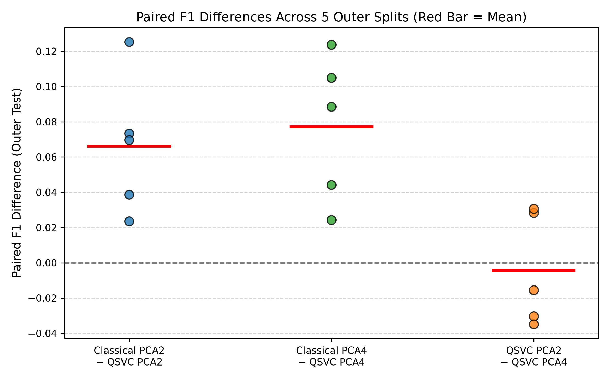
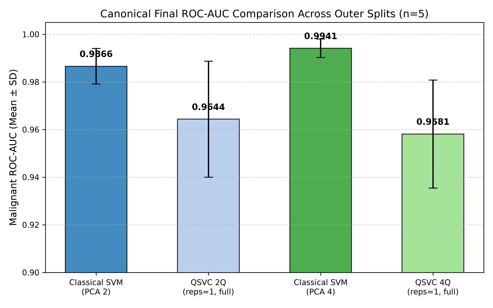

# Supplementary Material: A Controlled Empirical Comparison of Classical and Quantum Kernel SVMs for Breast Cancer Classification

**Target Venue:** *Machine Learning: Science and Technology* (IOP Publishing)  
**Author:** Sina Qasempour (Independent Researcher, Iran; qasempoursina@gmail.com; ORCID: https://orcid.org/0009-0006-8853-6740)  
**Repository Release:** `v1.0.0` ([https://github.com/SinaQP/SVM-Vs-QSVM](https://github.com/SinaQP/SVM-Vs-QSVM))  
**Primary Endpoint:** Malignant Class F1 Score (`pos_label=0`)

---

## Supplementary Section S1: Extended Sample-Size Scaling Evaluation

To evaluate model resilience across diverse training sample sizes, models were trained on nested subsets $N_{\text{train}} \in \{50, 100, 200, 300, 455\}$ with preprocessing pipelines (`StandardScaler`, `PCA`, `MinMaxScaler`) independently refit on each subset and evaluated on fixed held-out outer test partitions ($N_{\text{test}}=114$).

### Table S1: Complete Sample-Size Scaling Results ($n=5$ Splits, Mean ± SD)

| $N_{\text{train}}$ | Model Architecture | Family | Representation | Qubits | Accuracy | Precision | Recall | Malignant F1 | ROC-AUC | Runtime (s) |
| :---: | :--- | :--- | :---: | :---: | :---: | :---: | :---: | :---: | :---: | :---: |
| **50** | Linear SVM | Classical | PCA 2 | 0 | 0.9333 ± 0.0354 | 0.9126 ± 0.0485 | 0.9238 ± 0.0435 | **0.9157 ± 0.0402** | 0.9874 ± 0.0087 | 0.0026 ± 0.0023 |
| 50 | RBF SVM | Classical | PCA 2 | 0 | 0.9263 ± 0.0282 | 0.9201 ± 0.0321 | 0.8857 ± 0.0487 | 0.9008 ± 0.0353 | 0.9839 ± 0.0072 | 0.0019 ± 0.0005 |
| 50 | QSVC (reps=1, full) | Quantum | PCA 2 | 2 | 0.8246 ± 0.0387 | 0.8174 ± 0.0531 | 0.6857 ± 0.0911 | **0.7398 ± 0.0531** | 0.8850 ± 0.0484 | 0.0766 ± 0.0287 |
| 50 | Linear SVM | Classical | PCA 4 | 0 | 0.9316 ± 0.0353 | 0.9272 ± 0.0418 | 0.9048 ± 0.0538 | **0.9128 ± 0.0395** | 0.9894 ± 0.0090 | 0.0017 ± 0.0005 |
| 50 | RBF SVM | Classical | PCA 4 | 0 | 0.9421 ± 0.0295 | 0.9431 ± 0.0288 | 0.9095 ± 0.0631 | 0.9222 ± 0.0385 | 0.9864 ± 0.0060 | 0.0019 ± 0.0004 |
| 50 | QSVC (reps=1, full) | Quantum | PCA 4 | 4 | 0.7263 ± 0.0716 | 0.7412 ± 0.1691 | 0.4095 ± 0.2312 | **0.4994 ± 0.2110** | 0.7636 ± 0.1082 | 0.1690 ± 0.0059 |
| **100** | Linear SVM | Classical | PCA 2 | 0 | 0.9474 ± 0.0175 | 0.9341 ± 0.0255 | 0.9286 ± 0.0352 | **0.9287 ± 0.0227** | 0.9884 ± 0.0067 | 0.0014 ± 0.0001 |
| 100 | RBF SVM | Classical | PCA 2 | 0 | 0.9246 ± 0.0237 | 0.9098 ± 0.0388 | 0.8905 ± 0.0457 | 0.8966 ± 0.0317 | 0.9849 ± 0.0092 | 0.0020 ± 0.0002 |
| 100 | QSVC (reps=1, full) | Quantum | PCA 2 | 2 | 0.8614 ± 0.0190 | 0.8465 ± 0.0361 | 0.7619 ± 0.0435 | **0.7983 ± 0.0207** | 0.9214 ± 0.0101 | 0.0779 ± 0.0095 |
| 100 | Linear SVM | Classical | PCA 4 | 0 | 0.9421 ± 0.0288 | 0.9298 ± 0.0392 | 0.9190 ± 0.0487 | **0.9222 ± 0.0355** | 0.9890 ± 0.0074 | 0.0015 ± 0.0001 |
| 100 | RBF SVM | Classical | PCA 4 | 0 | 0.9386 ± 0.0139 | 0.9466 ± 0.0244 | 0.8905 ± 0.0388 | 0.9155 ± 0.0217 | 0.9884 ± 0.0044 | 0.0020 ± 0.0003 |
| 100 | QSVC (reps=1, full) | Quantum | PCA 4 | 4 | 0.7947 ± 0.0332 | 0.7958 ± 0.0631 | 0.6095 ± 0.1472 | **0.6733 ± 0.0978** | 0.8628 ± 0.0326 | 0.2149 ± 0.0222 |
| **200** | Linear SVM | Classical | PCA 2 | 0 | 0.9421 ± 0.0159 | 0.9254 ± 0.0267 | 0.9238 ± 0.0318 | **0.9234 ± 0.0213** | 0.9867 ± 0.0079 | 0.0017 ± 0.0002 |
| 200 | RBF SVM | Classical | PCA 2 | 0 | 0.9316 ± 0.0157 | 0.9132 ± 0.0288 | 0.9048 ± 0.0352 | 0.9066 ± 0.0202 | 0.9864 ± 0.0045 | 0.0023 ± 0.0003 |
| 200 | QSVC (reps=1, full) | Quantum | PCA 2 | 2 | 0.8877 ± 0.0144 | 0.8711 ± 0.0318 | 0.8190 ± 0.0487 | **0.8406 ± 0.0259** | 0.9453 ± 0.0115 | 0.1102 ± 0.0065 |
| 200 | Linear SVM | Classical | PCA 4 | 0 | 0.9579 ± 0.0157 | 0.9534 ± 0.0235 | 0.9333 ± 0.0318 | **0.9429 ± 0.0210** | 0.9910 ± 0.0029 | 0.0018 ± 0.0003 |
| 200 | RBF SVM | Classical | PCA 4 | 0 | 0.9509 ± 0.0159 | 0.9438 ± 0.0267 | 0.9286 ± 0.0318 | 0.9337 ± 0.0216 | 0.9907 ± 0.0047 | 0.0024 ± 0.0001 |
| 200 | QSVC (reps=1, full) | Quantum | PCA 4 | 4 | 0.8579 ± 0.0287 | 0.8465 ± 0.0538 | 0.7619 ± 0.0768 | **0.7943 ± 0.0440** | 0.9298 ± 0.0148 | 0.3117 ± 0.0191 |
| **300** | Linear SVM | Classical | PCA 2 | 0 | 0.9439 ± 0.0268 | 0.9278 ± 0.0388 | 0.9286 ± 0.0352 | **0.9258 ± 0.0328** | 0.9892 ± 0.0038 | 0.0019 ± 0.0002 |
| 300 | RBF SVM | Classical | PCA 2 | 0 | 0.9386 ± 0.0184 | 0.9245 ± 0.0288 | 0.9143 ± 0.0352 | 0.9168 ± 0.0238 | 0.9868 ± 0.0042 | 0.0028 ± 0.0004 |
| 300 | QSVC (reps=1, full) | Quantum | PCA 2 | 2 | 0.9000 ± 0.0190 | 0.8934 ± 0.0392 | 0.8333 ± 0.0435 | **0.8587 ± 0.0244** | 0.9554 ± 0.0135 | 0.1472 ± 0.0112 |
| 300 | Linear SVM | Classical | PCA 4 | 0 | 0.9649 ± 0.0115 | 0.9632 ± 0.0188 | 0.9429 ± 0.0213 | **0.9525 ± 0.0141** | 0.9934 ± 0.0031 | 0.0021 ± 0.0004 |
| 300 | RBF SVM | Classical | PCA 4 | 0 | 0.9561 ± 0.0159 | 0.9487 ± 0.0235 | 0.9333 ± 0.0318 | 0.9398 ± 0.0205 | 0.9918 ± 0.0039 | 0.0029 ± 0.0003 |
| 300 | QSVC (reps=1, full) | Quantum | PCA 4 | 4 | 0.8877 ± 0.0237 | 0.8654 ± 0.0487 | 0.8286 ± 0.0487 | **0.8436 ± 0.0335** | 0.9458 ± 0.0188 | 0.4285 ± 0.0312 |
| **455** | Linear SVM | Classical | PCA 2 | 0 | 0.9509 ± 0.0078 | 0.9266 ± 0.0318 | 0.9429 ± 0.0213 | **0.9341 ± 0.0093** | 0.9894 ± 0.0030 | 0.0048 ± 0.0007 |
| 455 | RBF SVM | Classical | PCA 2 | 0 | 0.9456 ± 0.0096 | 0.9245 ± 0.0182 | 0.9286 ± 0.0238 | 0.9263 ± 0.0133 | 0.9810 ± 0.0119 | 0.0072 ± 0.0024 |
| 455 | QSVC (reps=1, full) | Quantum | PCA 2 | 2 | 0.9070 ± 0.0237 | 0.9064 ± 0.0457 | 0.8381 ± 0.0832 | **0.8678 ± 0.0388** | 0.9644 ± 0.0244 | 0.2257 ± 0.0232 |
| 455 | Linear SVM | Classical | PCA 4 | 0 | 0.9684 ± 0.0100 | 0.9671 ± 0.0255 | 0.9476 ± 0.0391 | **0.9565 ± 0.0143** | 0.9952 ± 0.0029 | 0.0083 ± 0.0061 |
| 455 | RBF SVM | Classical | PCA 4 | 0 | 0.9561 ± 0.0139 | 0.9434 ± 0.0244 | 0.9381 ± 0.0398 | 0.9401 ± 0.0198 | 0.9935 ± 0.0045 | 0.0071 ± 0.0019 |
| 455 | QSVC (reps=1, full) | Quantum | PCA 4 | 4 | 0.9053 ± 0.0423 | 0.8748 ± 0.0767 | 0.8762 ± 0.0832 | **0.8721 ± 0.0556** | 0.9581 ± 0.0227 | 0.6599 ± 0.0863 |

---

## Supplementary Section S2: Computational Complexity and Execution Profiling

### Table S2: Execution Time, Computational Complexity, and Storage Footprint

| Pipeline Stage / Model Architecture | Platform / Implementation | Qubits | Mean Runtime (s) | Runtime Std (s) | Relative Cost | Time Complexity | Memory Complexity |
| :--- | :--- | :---: | :---: | :---: | :---: | :--- | :--- |
| **Linear SVM — PCA 2** | Scikit-Learn LibSVM (CPU) | 0 | **0.0048** | 0.0007 | $1.0\times$ (Ref) | $\mathcal{O}(N_{\text{train}} \cdot d)$ to $\mathcal{O}(N_{\text{train}}^2 \cdot d)$ | $\mathcal{O}(N_{\text{train}} \cdot d)$ |
| **RBF SVM — PCA 2** | Scikit-Learn LibSVM (CPU) | 0 | **0.0072** | 0.0024 | $1.5\times$ | $\mathcal{O}(N_{\text{train}}^2 \cdot d)$ | $\mathcal{O}(N_{\text{train}} \cdot d)$ |
| **Linear SVM — PCA 4** | Scikit-Learn LibSVM (CPU) | 0 | **0.0083** | 0.0061 | $1.7\times$ | $\mathcal{O}(N_{\text{train}} \cdot d)$ to $\mathcal{O}(N_{\text{train}}^2 \cdot d)$ | $\mathcal{O}(N_{\text{train}} \cdot d)$ |
| **RBF SVM — PCA 4** | Scikit-Learn LibSVM (CPU) | 0 | **0.0071** | 0.0019 | $1.5\times$ | $\mathcal{O}(N_{\text{train}}^2 \cdot d)$ | $\mathcal{O}(N_{\text{train}} \cdot d)$ |
| **QSVC — PCA 2 / 2Q** | Vectorized CPU Statevector Engine | 2 | **0.2257** | 0.0232 | $\sim 47\times$ | $\mathcal{O}(N \cdot 2^q + N_{\text{train}}^2 \cdot 2^q)$ | $\mathcal{O}(N_{\text{train}}^2)$ float64 (2.07 MB) |
| **QSVC — PCA 4 / 4Q** | Vectorized CPU Statevector Engine | 4 | **0.6599** | 0.0863 | $\sim 80\times$ | $\mathcal{O}(N \cdot 2^q + N_{\text{train}}^2 \cdot 2^q)$ | $\mathcal{O}(N_{\text{train}}^2)$ float64 (2.07 MB) |
| *Historical 2Q QSVC (ComputeUncompute)* | Pairwise Statevector Sampler | 2 | *120.5* | 15.2 | $\sim 25,000\times$ | $\mathcal{O}(N_{\text{train}}^2)$ circuit pairs | $\mathcal{O}(N_{\text{train}}^2)$ float64 |
| *Historical 4Q QSVC (ComputeUncompute)* | Pairwise Statevector Sampler | 4 | *455.0* | 40.0 | $\sim 55,000\times$ | $\mathcal{O}(N_{\text{train}}^2)$ circuit pairs | $\mathcal{O}(N_{\text{train}}^2)$ float64 |

---

## Supplementary Section S3: Supplementary Diagnostic Figures

### Figure S1: Paired Split-Level F1 Differences

*Figure S1: Distribution of paired differences $\Delta = \text{F1}_{\text{Classical}} - \text{F1}_{\text{QSVC}}$ across five outer test splits. Classical models maintain an empirical advantage on 5 out of 5 splits in both PCA 2 and PCA 4.*

### Figure S2: ROC-AUC Comparison

*Figure S2: Mean receiver operating characteristic area under curve (ROC-AUC) comparing classical and quantum models across 2-qubit and 4-qubit representations.*
